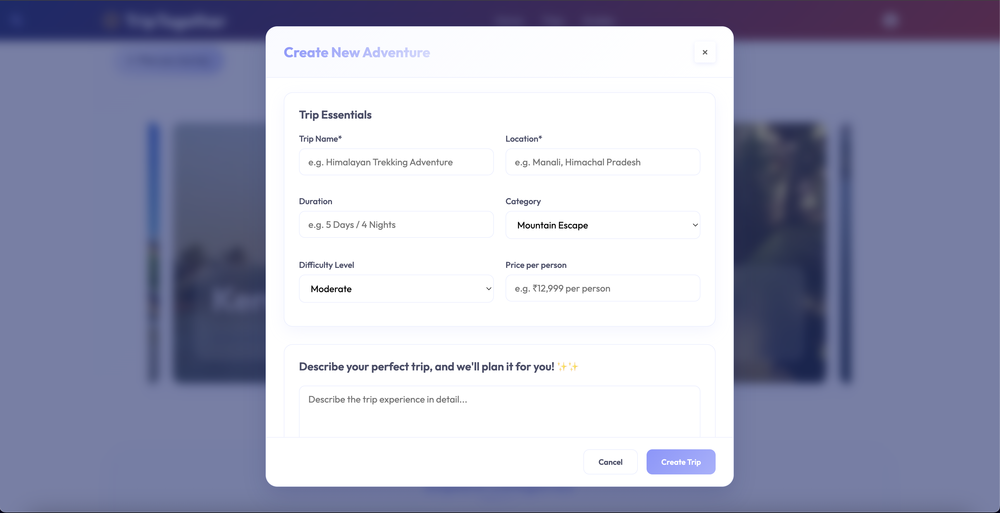

# 🌍 Trip Together

Plan personalized group trips across India with AI-powered recommendations, curated destinations, and seamless collaboration.

---

## 🚀 Features

- 🧠 **AI Trip Planner** – Describe your ideal trip and let AI generate the itinerary
- 🗺️ **Explore Destinations** – Discover popular and offbeat Indian places
- 👥 **Collaborative Planning** – Add and manage trips with friends
- 🗓️ **Day-by-Day Itinerary** – Create, view, and update daily plans
- 🔒 **Secure Login** – Google OAuth-based authentication
- 📦 **Fast API Integration** – Uses Fastify + schema-driven routes

---

# 🌐🌟 LIVE DEMO

# 👉 [🚀 trip-together-smoky.vercel.app](https://trip-together-smoky.vercel.app/)

> Click the link above to try the app live!

---

## 📸 Screenshots

| Landing Page | 
|--------------|
|  | 

| Home Page | Login Page | Create Trip View |
|------------------|-----------|-------------------|
|  |  |  |

---

## 🛠️ Tech Stack

- **Frontend:** Vite, React, TailwindCSS
- **Backend:** Node.js, Fastify, Mongoose
- **Auth:** Google OAuth via fastify-passport
- **Deployment:** Vercel (frontend), Railway/Render (backend)

---

## ⚙️ Getting Started

```bash
# 1. Clone the repository
git clone https://github.com/yourusername/trip-together.git
cd trip-together

# 2. Install dependencies
npm install

# 3. Create environment file
cp .env.example .env
# Add your API keys, MongoDB URI, and other secrets

# 4. Start development server
npm run dev
"# trip-together_admin" 
